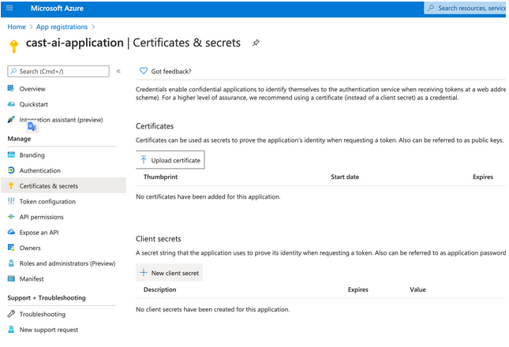
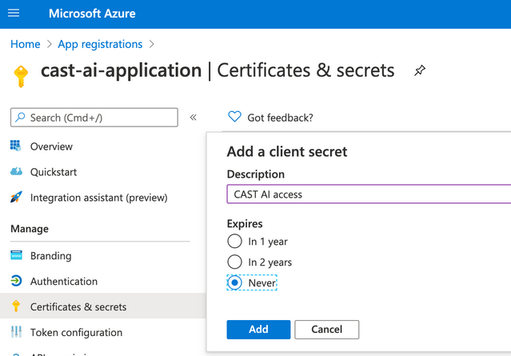
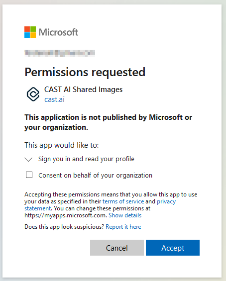
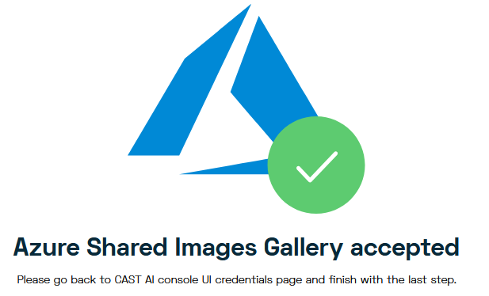
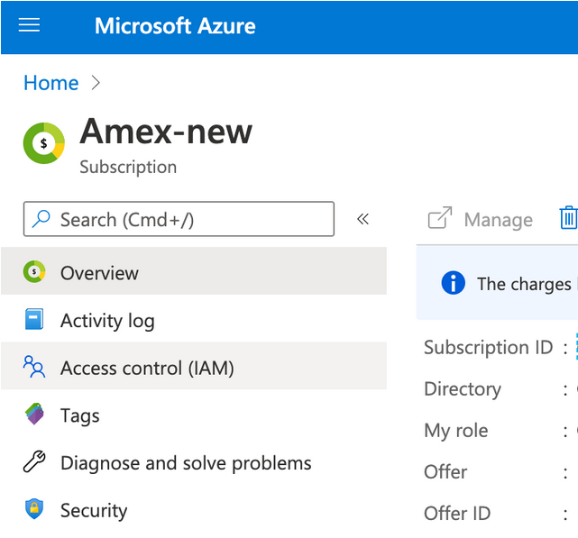
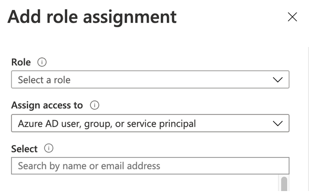

# Configure Azure credentials

The instructions we provide in this section will guide you in creating an external app registration. After completing
the instructions, you’ll get keys similar to the following that allow CAST AI to access your Azure Subscription
resources:

```
tenant id: 355069b9-fbb7-yyyy-xxxx-83d5a8709111
client id: 2d970aa5-4dde-yyyy-xxxx-36581dfff222
client secret: xvKds90f83&&#$$qwerty
subscription id: 697e39d3-4b01-yyyy-xxxx-75266e90c333
```

Open <https://portal.azure.com/> and go to the **App registrations** section:


Click on **New registration** and complete the registration by entering the **Name** and selecting **Multi-tenant**
access.


Once you complete the registration, you’ll end up on the App Overview page.

Save the Application (client) ID and Directory (tenant) ID from this page. They represent **Tenant ID** and
**Client ID** keys from the required outputs of these instructions.

Click on **Certificates & secrets** in the **Manage** tab and click **New client secret**.




Enter meaningful **descriptions** and select **secret expiry time**. Click **Add**.



Copy the secret **value** you have created. It will be used as **Client Secret** when you enter it into CAST AI console.


## Give access to the CAST AI application by requesting a sign-in using a browser

1 - Make sure to click the link on our console where you have pasted the keys.


2 - After login, you should see the **Permissions requested** window. Click Accept which will allow adding CAST AI
application role.



You should see it like this:



## Assigning the roles

Go to **Subscriptions**

Select **subscription** to which you want to give CAST AI access


Take note of the **Subscription ID**. This is the last item required for your Azure app credentials.

We have one more step left here. Create a Role assignment between the previously created App registration and this
Subscription.

Go to **Access control (IAM)**.


Click on **Add → Add role assignment**


The following sidebar will appear



In the **Role** dropdown, select **Contributor**. In the **Select** field type your **Client Secret** (created during the first step).

.png)

Add another role assignment with Role: **Contributor**, and in the **Select** input field search for **CAST AI Shared Images** then click save (if the role is not visible please check previous step and try again).


This is it. After taking all of the steps above, you should have the required keys to create your first azure cluster! 