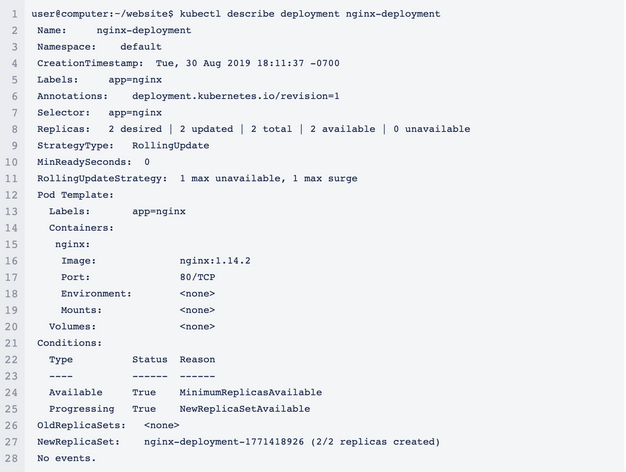

# How to deploy the application

A CAST AI managed Kubernetes cluster is no different than vanilla Kubernetes - it just runs on multi-cloud. Having this
in mind, you can deploy an application just like you would in any Kubernetes cluster - by using **kubectl**.

After creating your cluster in the CAST AI console and making sure that it’s in the ready state, you can download the
cluster’s **kubeconfig**:


For detailed instructions on how to use a downloaded kubeconfig file, check the
[official Kubernetes documentation](https://kubernetes.io/docs/concepts/configuration/organize-cluster-access-kubeconfig/).

The quickest way is simply by setting a downloaded file as KUBECONFIG env variable in your shell. For example:

```
export KUBECONFIG=~/Downloads/my-cluster_config
```

Once you do this, you will have access to my-cluster in your used shell. From now on, you can deploy any application
using kubectl. Here’s a
[tutorial from Kubernetes official documentation](https://kubernetes.io/docs/tutorials/kubernetes-basics/deploy-app/deploy-intro/).

If you’re tired of reading documentation and just want to get started, run the following:

```
kubectl apply -f https://k8s.io/examples/application/deployment.yaml
```

The command will use the following deployment YAML file from k8s, for example:

```
apiVersion: apps/v1
kind: Deployment
metadata:
  name: nginx-deployment
spec:
  selector:
    matchLabels:
      app: nginx
  replicas: 2 # tells deployment to run 2 pods matching the template
  template:
    metadata:
      labels:
        app: nginx
    spec:
      containers:
      - name: nginx
        image: nginx:1.14.2
        ports:
        - containerPort: 8
```

For displaying information about the Deployment run:

```
kubectl describe deployment nginx-deployment
```

The output is similar to this:



List the pods created by the deployment:

```
kubectl get pods -l app=nginx
```

The output is similar to this:


Display information about a Pod:

```
kubectl describe pod <pod-name>
```

where `<pod-name>` is the name of one of your Pods.
